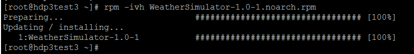
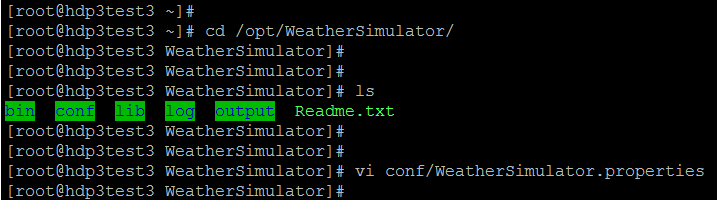
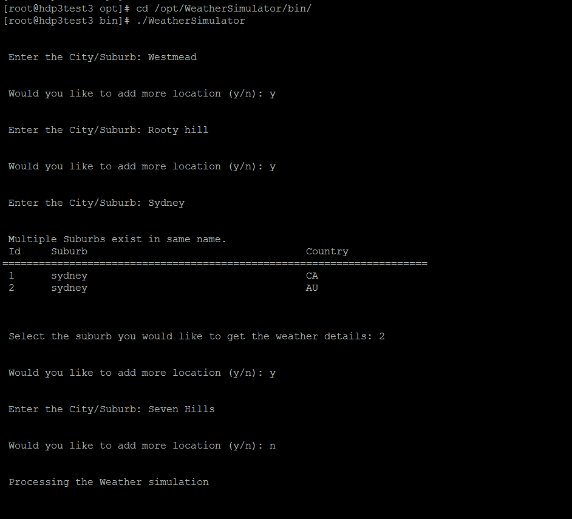
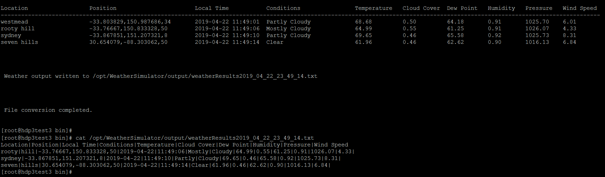
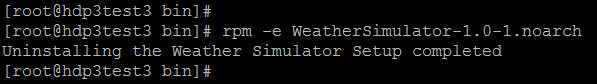

# Weather Simulator

**Weather-Simulator** is a Java tool to predict weather for a location.

## Approach
The tool predicts the weather data like Temperature, Cloud Cover, Dew Point, Humidity, Pressure, Wind Speed, Summary for a given location. 

High level flow:-

1) Get the location details from User.

2) Based on location, get the Lat/Long coordinates using the configuration file LatLongCity.list.json.

3) Get the elevation of a location using Elevation API (https://elevation-api.io/) 

4) Get the current weather data using Dark Sky API (https://darksky.net/dev) for that location.

5) Get the weather data for last N days for that location using Dark Sky API. 

6) Get the last year weather data (Historical data) for that location using Dark Sky API. This includes ( LAST_YEAR_N_PREVIOUS_DAYS + LAST_YEAR_CURRENT_DATE + LAST_YEAR_N_SUBSEQUENT_DAYS ) weather data.

7) Last N days weather data is used to predict the features - Temperature, Cloud Cover, Dew Point, Humidity, Pressure, Wind Speed.
 
Predicted value of a feature = Mean of a feature for last N days + Random number within ( 0 to Standard Deviation of that feature)

8) Last year weather data is used to predict the Summary Feature. Values of Summary Feature can be Sunny, Snow, Rain, Cloudy, Partly Cloudy, Clear etc.
 
Prediction of Summary Feature = Euclidean distance between predicted Weather data and last year weather data and get the summary that have minimum distance    


## Technology Stack
* Java 8
* Maven
* JUnit
* RPM
 
## Usage Instructions
1. Update the Weather API Key 

   The tool uses the Dark Sky API to get the recent weather and historical weather details. 
 
   Register the user in https://darksky.net/dev/register login to Dark Sky API - https://darksky.net/dev/account to get the secret key. 
 
   Open the WeatherSimulator.properties and update the property weatherAPI.connector.key
  
   
2. Build using maven

   Update the Weather API Key (property weatherAPI.connector.key) in src/test/resources/WeatherSimulator.properties
 
    ```mvn clean compile package -DWeatherSimulator.properties=src/test/resources/WeatherSimulator.properties```

	Build will compile, test and generate the RPM and final RPM is copied to [RPM Directory](RPM/)
	
3. Install RPM

   Click here to download the [RPM](https://github.com/AnalyticsApps/WeatherSimulator/raw/master/RPM/WeatherSimulator-1.0-1.noarch.rpm)
 
    ```
    [root@hdp3test3 ~]# rpm -ivh WeatherSimulator-1.0-1.noarch.rpm
	Preparing...                       ################################# [100%]
	Updating / installing...
	1:WeatherSimulator-1.0-1           ################################# [100%]
	[root@hdp3test3 ~]#
     
    ```
    

4. Running the script
 
    After installing RPM, Application will be available under /opt/WeatherSimulator
    * The scripts will be available under /opt/WeatherSimulator/bin/
    * Configuration files & log4j.properties are under /opt/WeatherSimulator/conf/
    * The application logs will be in /opt/WeatherSimulator/log/
    * The forecast output will be written to files under /opt/WeatherSimulator/output/

	
    ```
        [root@hdp3test3 ~]# cd /opt/WeatherSimulator/

        [root@hdp3test3 WeatherSimulator]# ls
        bin  conf  lib  log  output  Readme.txt
        [root@hdp3test3 WeatherSimulator]#
    ```
    

    Update the Weather API Key (property weatherAPI.connector.key) in /opt/WeatherSimulator/conf/WeatherSimulator.properties

    ```
        [root@hdp3test3 opt]# cd /opt/WeatherSimulator/bin/
        [root@hdp3test3 bin]# ./WeatherSimulator
        
         Enter the City/Suburb: Westmead
        
         Would you like to add more location (y/n): y
        
         Enter the City/Suburb: Rooty hill
        
         Would you like to add more location (y/n): y
        
         Enter the City/Suburb: Sydney
        
         Multiple Suburbs exist in same name.
         Id     Suburb                                    Country
        ======================================================================
         1      sydney                                    CA
         2      sydney                                    AU
        
        
         Select the suburb you would like to get the weather details: 2
        
         Would you like to add more location (y/n): y
        
         Enter the City/Suburb: Seven Hills
        
         Would you like to add more location (y/n): n
        
        
         Processing the Weather simulation
        
        
        Location     Position                   Local Time           Conditions     Temperature Cloud Cover  Dew Point   Humidity   Pressure   Wind Speed
        ---------------------------------------------------------------------------------------------------------------------------------------------------
        westmead     -33.803829,150.987686,34   2019-04-22 11:49:01  Partly Cloudy  68.68       0.50         64.18       0.91       1025.70    6.01
        rooty hill   -33.76667,150.833328,50    2019-04-22 11:49:06  Mostly Cloudy  64.99       0.55         61.25       0.91       1026.07    4.33
        sydney       -33.867851,151.207321,8    2019-04-22 11:49:10  Partly Cloudy  69.65       0.46         65.58       0.92       1025.73    8.31
        seven hills  30.654079,-88.303062,50    2019-04-22 11:49:14  Clear          61.96       0.46         62.62       0.90       1016.13    6.84
        
        
         Weather output written to /opt/WeatherSimulator/output/weatherResults2019_04_22_23_49_14.txt
        
         File conversion completed.
        
        [root@hdp3test3 bin]#
        
        [root@hdp3test3 bin]# cat /opt/WeatherSimulator/output/weatherResults2019_04_22_23_49_14.txt
        Location|Position|Local Time|Conditions|Temperature|Cloud Cover|Dew Point|Humidity|Pressure|Wind Speed
        rooty|hill|-33.76667,150.833328,50|2019-04-22|11:49:06|Mostly|Cloudy|64.99|0.55|61.25|0.91|1026.07|4.33|
        sydney|-33.867851,151.207321,8|2019-04-22|11:49:10|Partly|Cloudy|69.65|0.46|65.58|0.92|1025.73|8.31|
        seven|hills|30.654079,-88.303062,50|2019-04-22|11:49:14|Clear|61.96|0.46|62.62|0.90|1016.13|6.84|
        [root@hdp3test3 bin]#
            
    ```
    

    

5. Uninstalling RPM

    ```
        [root@hdp3test3 bin]# rpm -e WeatherSimulator-1.0-1.noarch
        Uninstalling the Weather Simulator Setup completed
        [root@hdp3test3 bin]#
    ```
    

## Credits

This application uses API's provided by below third parties. 
 
1) Dark Sky API (https://darksky.net/dev) to get the recent weather and historical weather details.
2) Elevation API (https://elevation-api.io/) to get the elevation for a latitude/longitude coordinates.
3) OpenWeatherMap (https://openweathermap.org/api) to get the latitiude/longitude for a location.
	
## Author

**Nisanth Simon** - [NisanthSimon@LinkedIn]

[NisanthSimon@LinkedIn]: https://au.linkedin.com/in/nisanth-simon-03b2149
 
